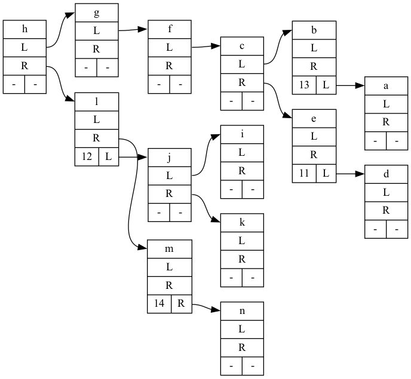

# Persistent Tree

The goal of this gem is to provide a Partially-Persistent Tree implementation for Ruby. A Partially-Persistent Tree can be used to efficiently maintain and access previous versions of tree-based data structures, such as Maps and Sets.

This work is based on Okasaki's thesis *[Purely Functional Data Structures](http://www.cs.cmu.edu/~rwh/theses/okasaki.pdf)* and lectures available online for the MIT *[Advanced Data Structures](https://courses.csail.mit.edu/6.851/)* course.

## Design

The PersistentTree::Map class provides an interface that is designed to mimic Ruby's built-in Hash class. That is to say that using a PersistentTree::Map in place of a Hash should be completely unsurprising.

As a Partially-Persistent data structure, each update to a Map results in a new version of the Map being spawned using an approach that is memory efficient relative to the number of key-value pairs in the Map. Previous versions of a Map are accessible through read-only 'views' of the data structure.

A PersistentTree::Map object provides a method called 'version' that, when called with no arguments, returns the current version. When called with one argument (a version number), it will return a view of the Map at that version.

A user of this library might use it like so:

    m = PersistentTree::Map.new   # Create a new map
    m.version                     # Returns current version number (0)
    m['k'] = 'v'                  # Returns stored value ('v')
    m.version                     # Returns current version number (1)
    m['k']                        # Returns stored value ('v')
    m.version(0)                  # Returns a read-only view of version 0
    m.version(0)['k']             # Returns nil (default value)
    m.version(0).fetch('k')       # Raises KeyError
    m.store('k', 'w')             # Returns stored value ('w')
    m.version(1).fetch('k')       # Returns stored value in version 1 ('v')

## Shortcomings

This gem is still very much a work-in-progress. Just off the top of my head, any user of this gem should be aware of the following limitations and shortcomings:

* Deletion of key-value pairs is not supported - at least not in a way that will lead to new versions of the map being created
* Performance is currently unmeasured
* RSpec tests are provided, but coverage is weak for the underlying Tree class
* No form of fuzzing has been conducted, so input validation should be considered untested

## Graphviz

The example script in [bin/example](bin/example) shows how the library can be used to visualise the persistent tree data structure. The script adds the letters 'a' to 'n' to a tree, in random order. After each addition, the tree representing the latest version is dumped to a file in the `tmp` directory. These are written in DOT format, and can be converted to PNG or PDF using `dot`:

    dot -T pdf ./tmp/v14.dot > ./tmp/v14.pdf
    dot -T png ./tmp/v14.dot > ./tmp/v14.png

An example is shown here:

There is also a corresponding [example.pdf](./example.pdf).

The way to interpret this is that the first field in a record is a node's key. After that are its left and right children. And the last field represents a 'mod' applied to that node. If the node has been modified, it shows the version corresponding to the modification, as well as the updated child pointer (either left or right).

## License

This code is licensed under the MIT License.

See the LICENSE file for more information.
